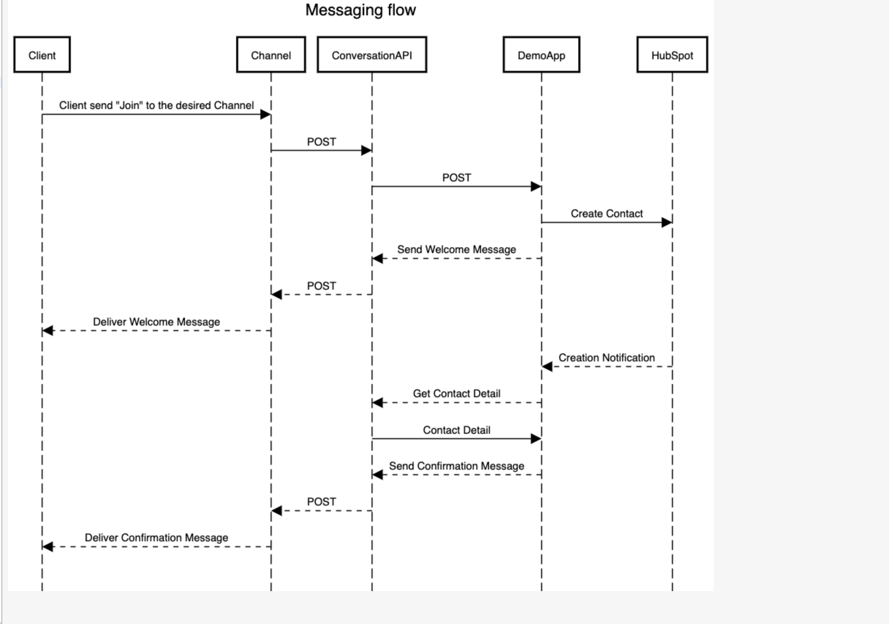
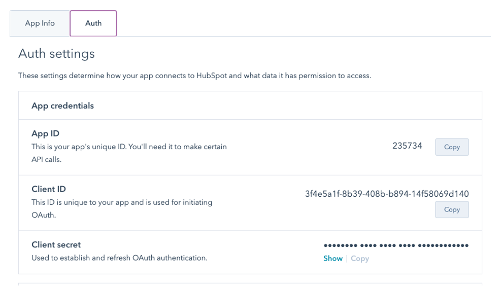
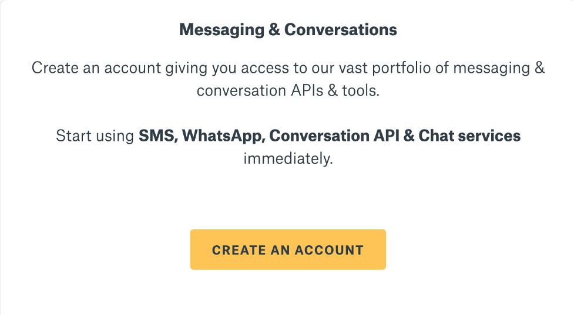

# Sinch And HubSpot Integration Demo 

## Introduction
With a CRM like HubSpot, there is the advantage to manage a list of customers and use one API for multiple channels. There is no need to spend the time to configure and learn how to configure the various APIs when only one API can be used for more than one channel.

The following demo will show how one API can be set up quickly, work across multiple channels, and reduce the learning curve to a minimal. 

## What in this demo:

The demo will show how different clients from various channels can interact to the application. From there, the information of the client can be saved to HubSpot. HubSpot can then use a universal Conversation API to interact back to the client.

## Set up

First, create a .env file to hold the following variables

hubspot_client_id=${VALUE} # hubspot client id 
hubspot_client_secret=${VALUE} # Hubspot client secret
hubspot_redirect_uri=${VALUE} # the URI link for the application to obtain access token from Hubspot
SINCH_APP_ID=${VALUE} # Sinch APP ID
SINCH_PROJECT_ID=${VALUE} # Sinch Project Id
sinch_client_id=${VALUE} # Sinch Client Id
sinch_client_secret=${VALUE} # Sinch Client Secret

Visit HubSpot to create a developer account and app to obtain client_id, client_secret. To get these values, go under the Auth Info tab when your app is created. 

Visit Sinch to set up a Sinch Account. 

To configure channels within Sinch, visit Quick Start. There is a variety of channels that can be configured (i.e. Messenger, SMS, Viber, Whatsapp, and RCS). To learn more about the channels that are offered visit https://developers.sinch.com/. 
Next, install Ngrok to expose your app to the world. 

## Running App. 

Once everything is installed, use a terminal to start running the app. Go to Terminal on Mac or Command prompt on Windows, and run the following command to start the app.
npm install 

Run the next command.
ngrok http 3000

The app is now running and exposed to the world!

Note: To configure redirect_uri as {ngrok_link/auth}, visit hubspot  
e.g. https://9c88e5323886.ngrok.io/auth
